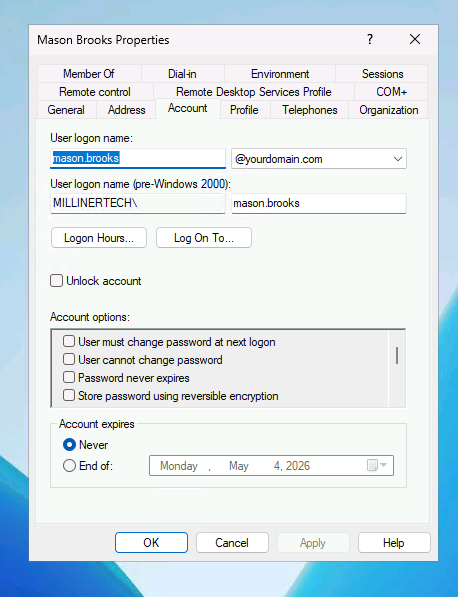
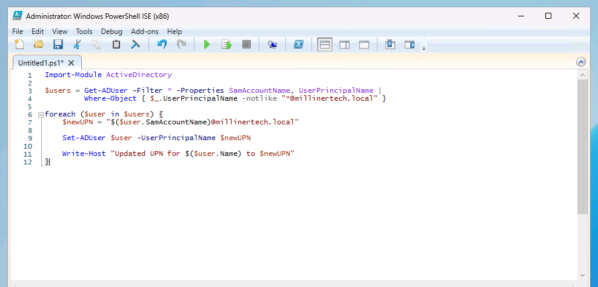
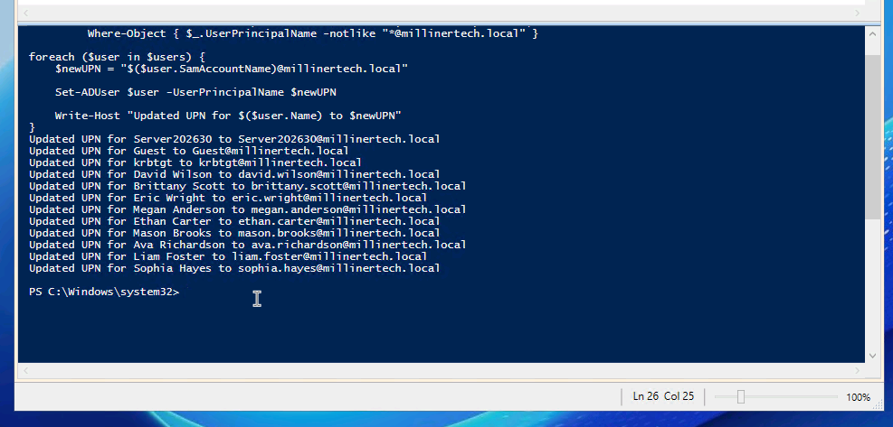

# Changing-UPN-PowerShell

## 🚀 Skills Demonstrated
- Bulk account updates using scripting (PowerShell) for consistency
- Automation to reduce manual work and errors
- Active Directory user account maintenance and updates
- Troubleshooting and verifying account updates in a domain environment

---
### Users not on UPN
I noticed some of the users weren't on the same UPN so I opened PowerShell to run a script to change all UPNs of users not on millinertech.local.  
   

 ---
 ---

 This is the script I typed up for changing all users UPN. What the script is doing is looking for all of the users in the $users variable I created to find which users don't have the UPN "millinertech.local".  
   

---
---

### The Outcome  
   
